 Assignment-1
* All tasks are here.
## Git Commands

### Task-1
<hr>

```bash
    1- git config : adjust username, mail etc
```  

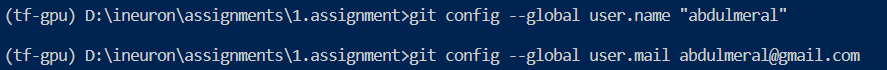

<hr>

```bash
    2- git init : transform the working directory to Git Repo.
    Create .git directory.
```  

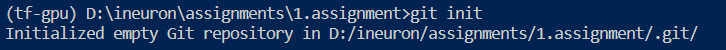

<hr>

```bash
    3- git status : Show modidified files.
```  

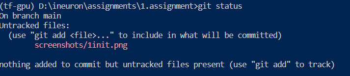

<hr>

<hr>

```bash
    4- git clone : make a copy of a repo.
```  

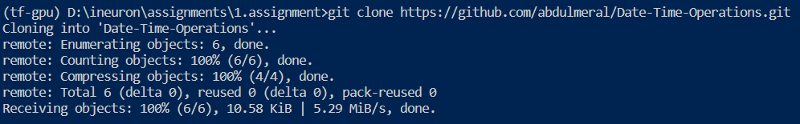
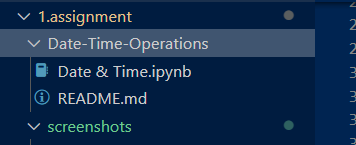

<hr>

```bash
    5- git rm : remove a file/directory. -f :force
```  

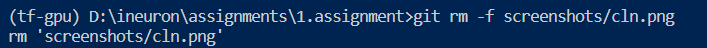

<hr>

```bash
    6- git add Readme.md : one file sends to index.
       git add . : all files send to index.
```  

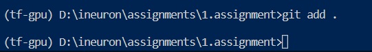

<hr>

```bash
    7- git commit : save file to local repo. (in .git)
```  

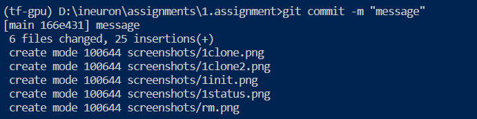

<hr>

```bash
    8- git push : after commit send changes to Github Repo.
```  

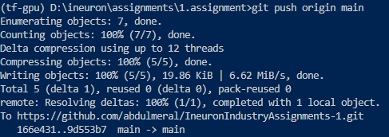

<hr>

```bash
    9- git pull : update local repo.
       *Do it before push. 
```  


<hr>

```bash
    10- git log : show logs. type q to exit.
```  

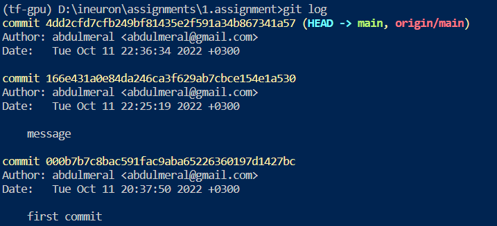

<hr>

```bash
    11- git branch : manage branches here.
        git branch branch_name : create new branch
```  

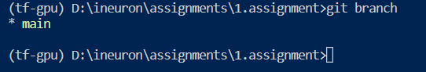

<hr>

```bash
    12- git checkout branch_name : switch branches.
```  

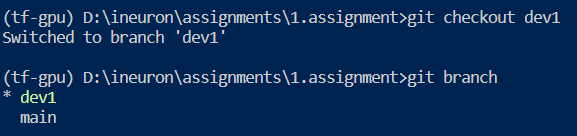

<hr>

```bash
    13- git merge branch_name : combine branches pasts.
```  

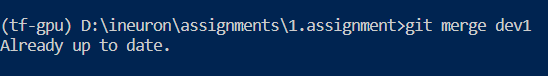

<hr>

```bash
    14- git remote : connect local repo to github repo.
```  

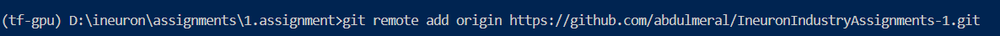

<hr>

```bash
    15- git diff : show differences.
```  

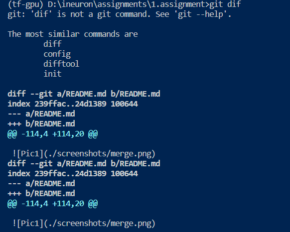

<hr>

### Task-2
* Created Company Directory and initialized a git repo.


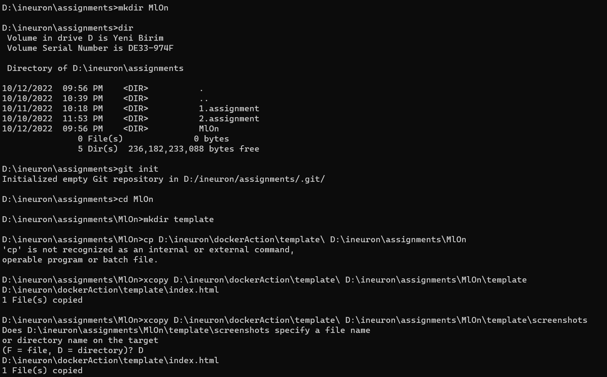
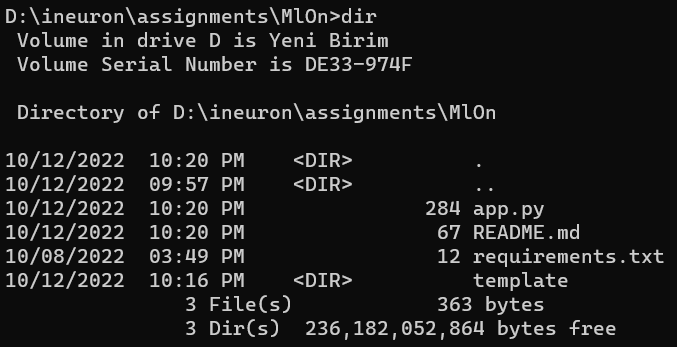
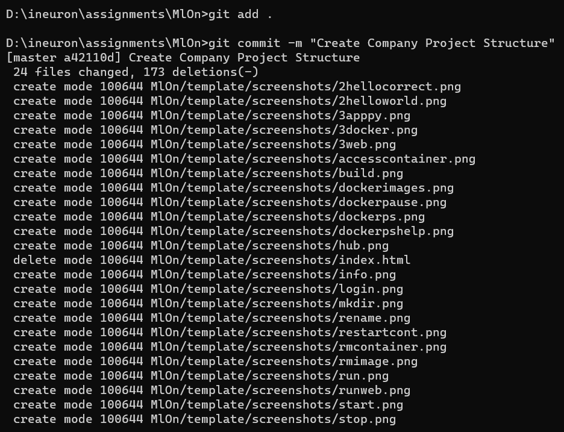
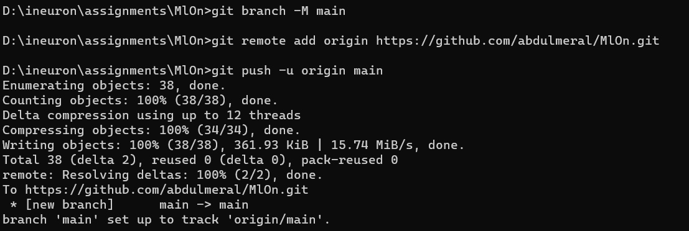
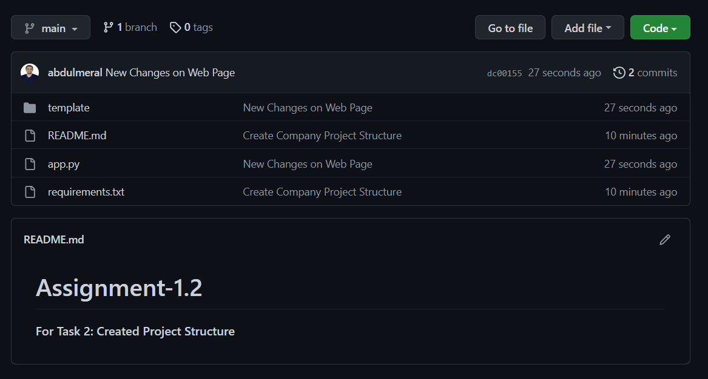

* Two collaborators are added.
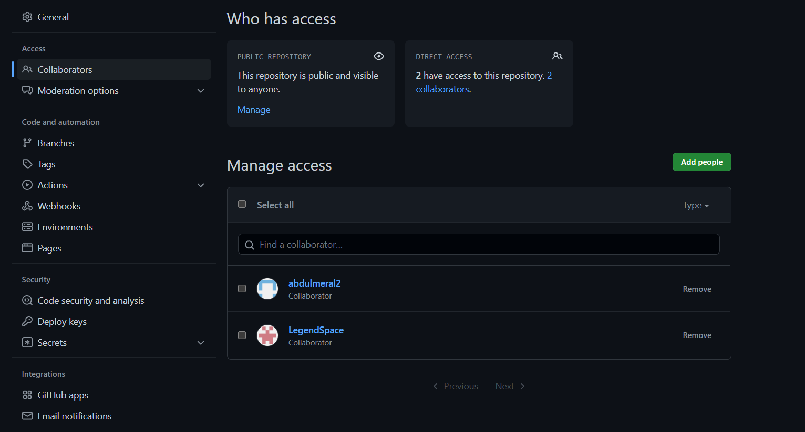

* Host GitHub Pages using settings.
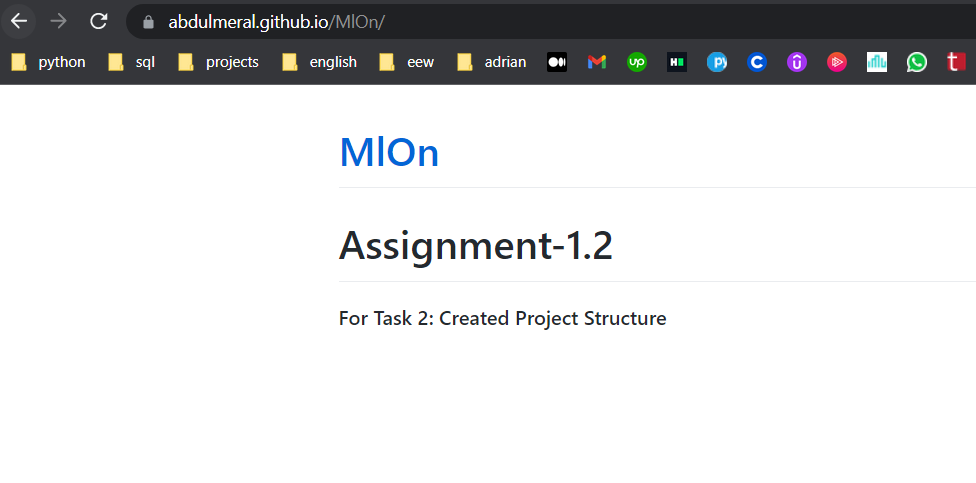